🚀 Examys - Online Learning Platform

Examys is an online education platform that provides structured courses, video classes, and test series for government exam preparation.

📸 Screenshots
🏠 Homepage (Desktop View)

## 📽️ Demo Videos

📱 **Mobile App View:** [Watch here](https://youtube.com/shorts/Qw6818U5yLs?si=78xTDW2C9m4MgvH8)  

💻 **Web App View:** [Watch here](https://youtu.be/N2_HI8G9M-A?si=_Dd0N9wO_SmUnlb)  

📽️ Demo images
📱 Mobile App View
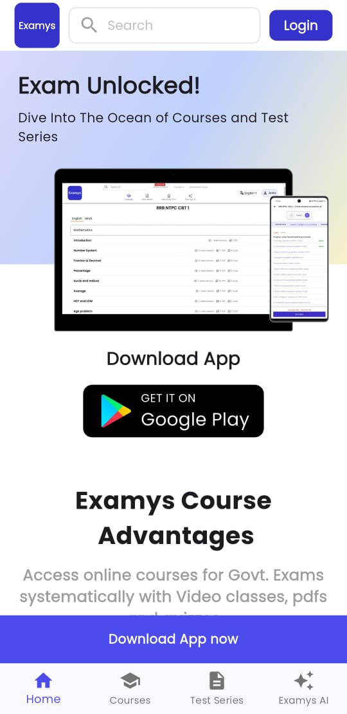
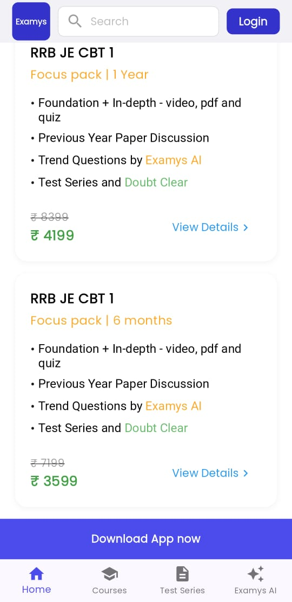
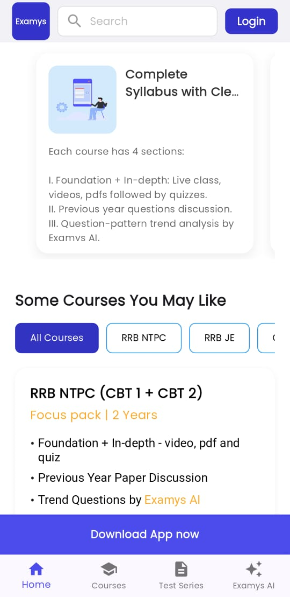
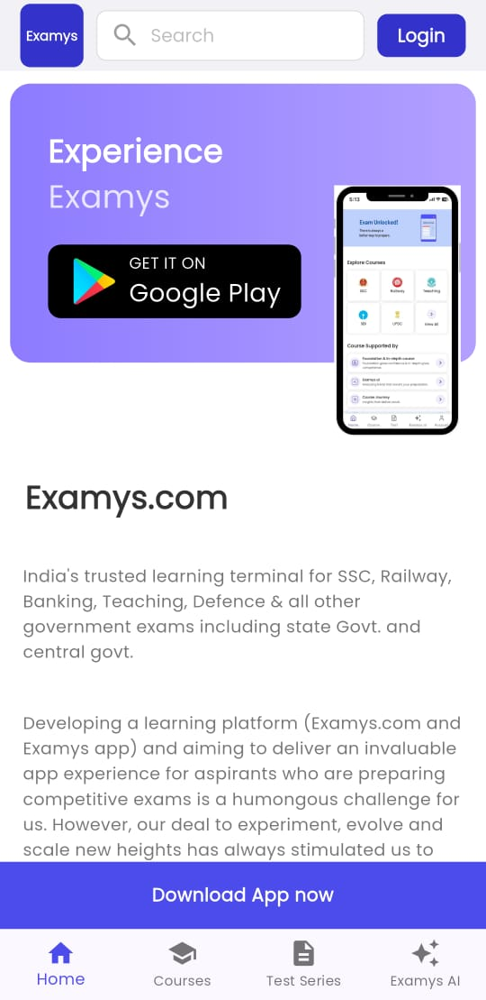
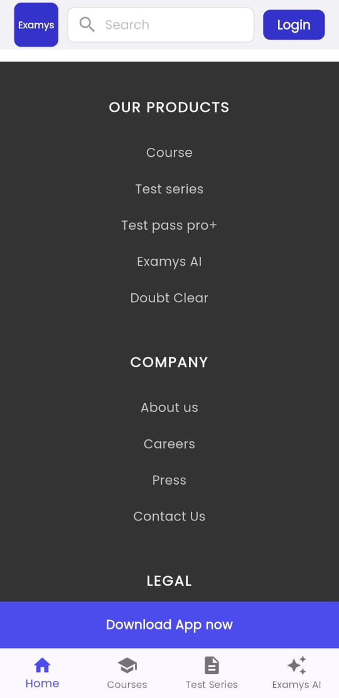

💻 Web App View

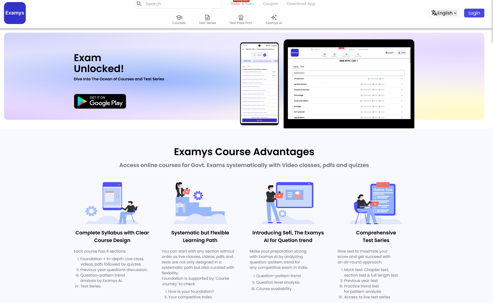
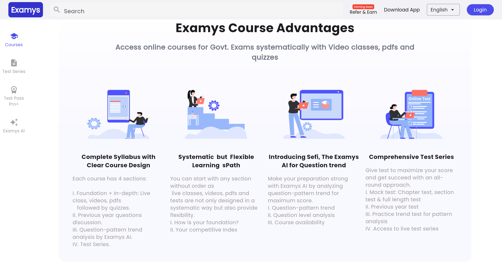
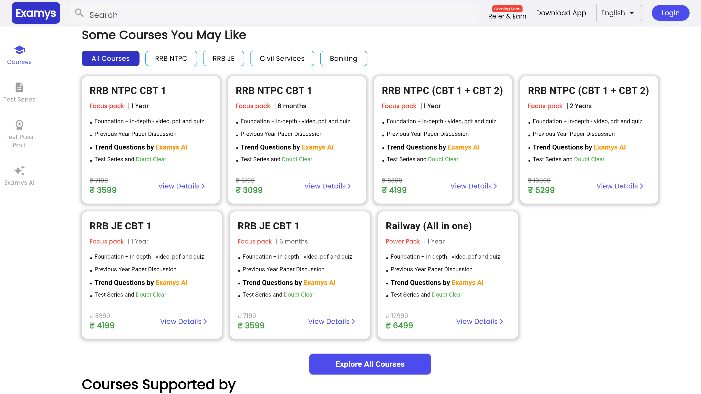
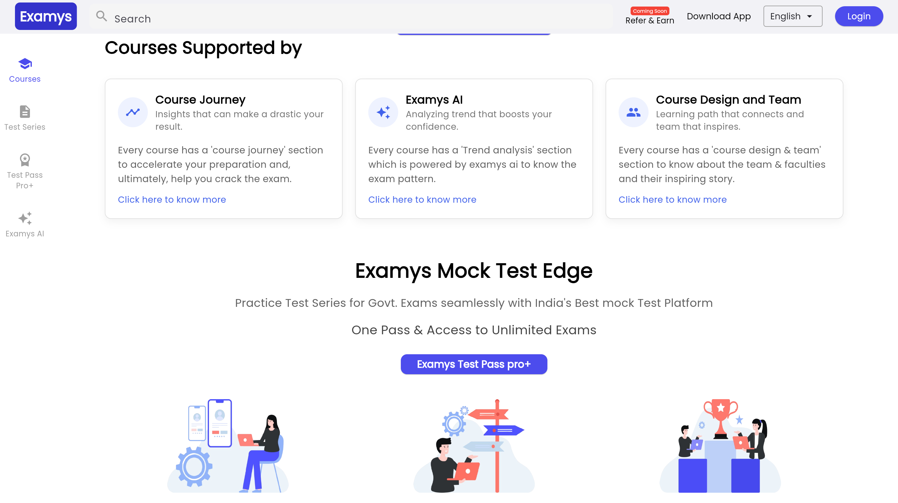
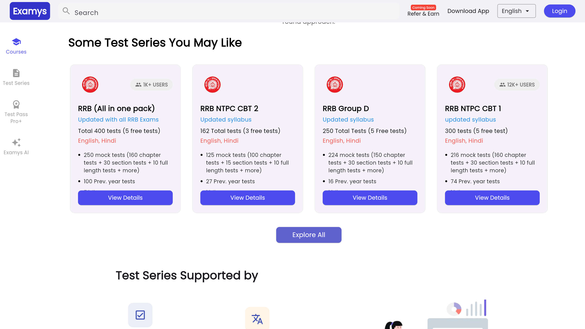
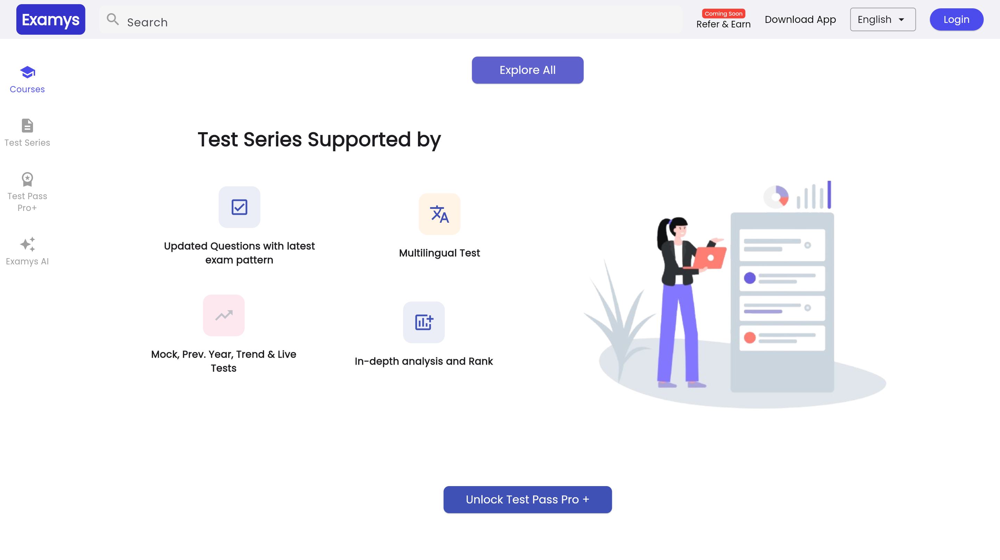
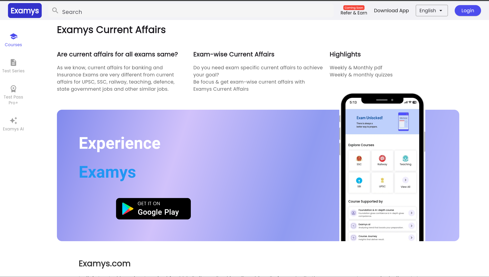
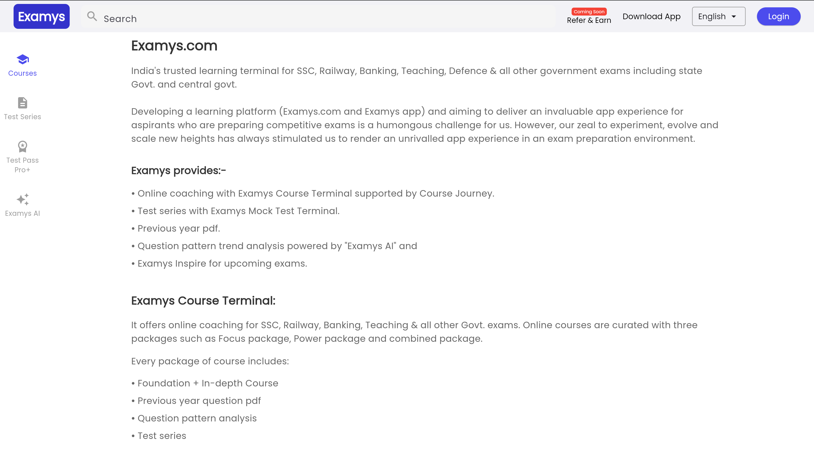
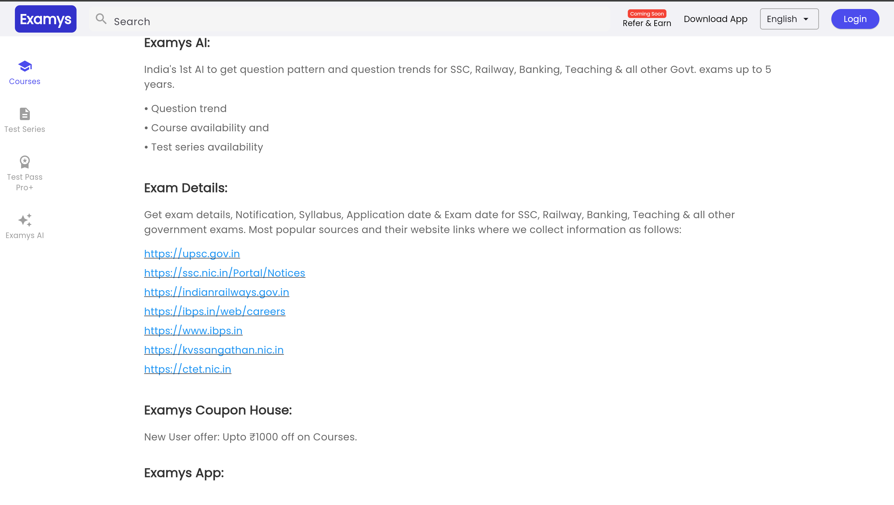
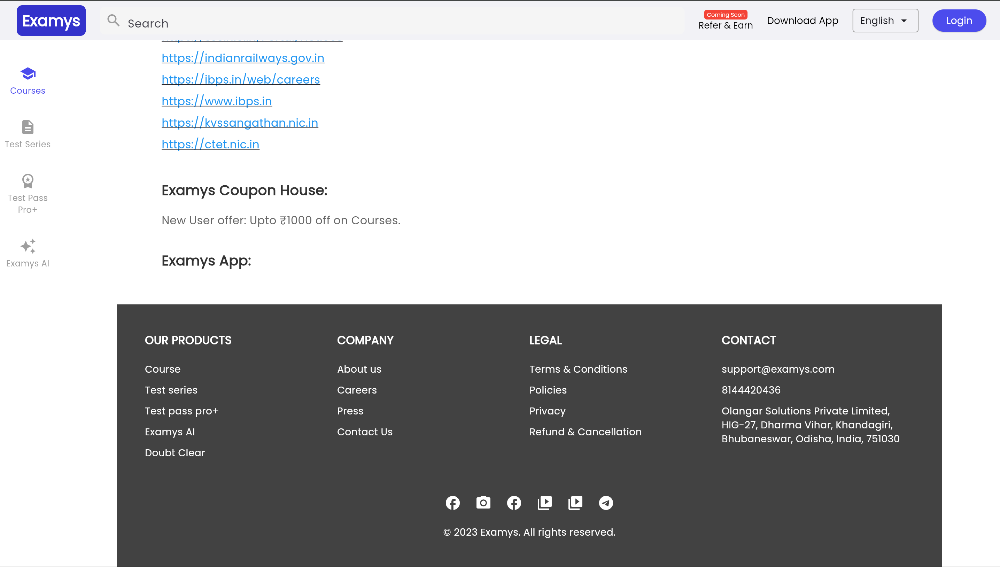

📌 Features
✔️ Complete Syllabus – Live classes, videos, PDFs, and quizzes.
✔️ Flexible Learning Path – Access any section in any order.
✔️ Examys AI (Sefi) – AI-powered question trend analysis.
✔️ Comprehensive Test Series – Mock tests, previous year questions, and live tests.